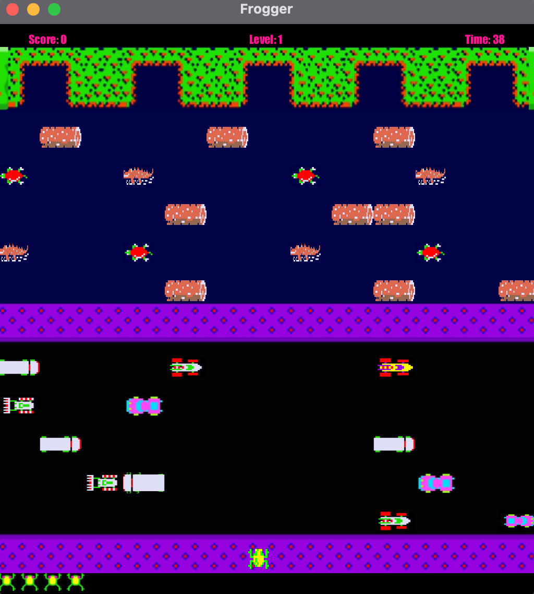
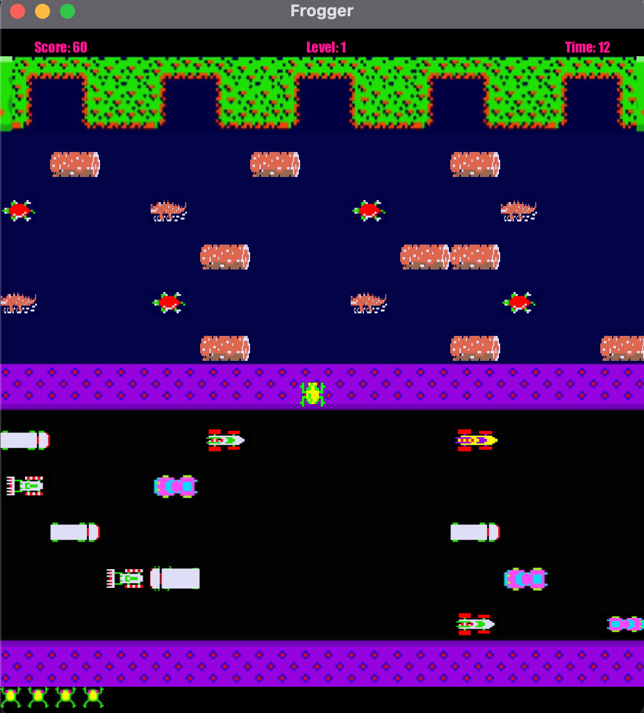

# Frogger Game Clone

A JavaFX implementation of the classic Frogger game.

## Prerequisites
- Java 21 or higher

## How to Run
## Building from Source
1. Install Java 21 or higher
2. Install Maven
3. Clone this repository
4. Run: `mvn clean package`
5. Edit `run.bat` (for Windows) or `run.sh` (for Mac/Linux) to include the path to your JavaFX SDK.
6. Execute the script: `run.bat` (Windows) or `run.sh` (Mac/Linux).

## Screenshots

## License

This project is licensed under the MIT License. See the [LICENSE](LICENSE) file for details.
